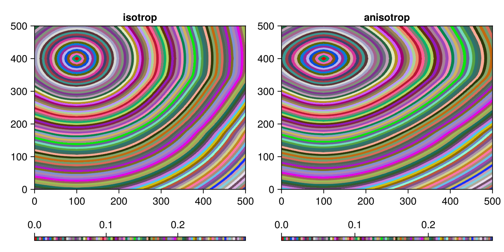

# SeisTimes

[](https://wtegtow.github.io/SeisTimes.jl/dev/)
[](https://github.com/wtegtow/SeisTimes.jl/actions/workflows/CI.yml?query=branch%3Amain)

SeisTimes computes first-arrival traveltimes in heterogeneous 2D and 3D anisotropic media. 
It solves the Lax-Friedrich approximation of Hamilton-Jacobi equations applied to the Eikonal equation using a Fast Sweeping numerical scheme. 
Implemented are 1st-, 3rd-, and 5th-order Lax-Friedrichs schemes.


# Installation
``` julia 
using Pkg
Pkg.add(url="https://github.com/wtegtow/SeisTimes.jl")
```

# Quick Start 

The application exports 3 functionalities:
- Solid2D 
- Solid3D
- fast sweep

The solid object constructors take x,z or x,y,z coordinates and nx,nz or nx,ny,nz arrays of P-wave and S-wave velocities for 2D and 3D problems, respectivly. 

Optional keyword arguments can be used to define anisotropic media:

```julia

iso2D = Solid2D(x_coords, z_coords, vp, vs)
vti2D = Solid2D(x_coords, z_coords, vp, vs; eps=eps, gam=gam, del=del)

iso3D = Solid3D(x_coords, y_coords, z_coords, vp, vs)
ort3D = Solid3D(x_coords, y_coords, z_coords, vp, vs; 
                eps1=eps1, eps2=eps2, gam1=gam1, gam2=gam2,
                del1=del1, del2=del2, del3=del3)

```

Where:

eps, gam, del are 2D Thomsen anisotropy parameters
eps1, eps2, gam1, gam2, del1, del2, del3 are 3D Tsvankin anisotropy parameters
Once defined, the solid objects can be passed to the fast_sweep function to compute traveltimes.
The following example shows a basic 2D use case. The 3D version works analogously.

```julia

using SeisTimes
using GLMakie
Makie.inline!(true)

# 2d example
h = 10 
x_coords = 0:h:500 
z_coords = 0:h:500 

vp  = zeros(length(x_coords), length(z_coords)) .+ 2000
vs  = zeros(length(x_coords), length(z_coords)) .+ 1000
eps = zeros(length(x_coords), length(z_coords)) .+ 0.25
del = zeros(length(x_coords), length(z_coords)) .- 0.1

# add some heterogeneity 
vp[:, 18:34] .= 1800.0  

# source location
source = [(100, 400)]

# create solid objects
iso = Solid2D(x_coords, z_coords, vp, vs)
vti = Solid2D(x_coords, z_coords, vp, vs; eps=eps, del=del)

# algorithm parameter 
wavemode = :P # :P, :S 
scheme = :LxFS5 # LxFS1 -> 1st order, LxFS3 -> 3rd order, LxFS5 -> 5th order Lax-Friedrich schemes 
verbose = false  
max_iter=200
max_error_tol = 1e-5   # convergence criterium
viscosity_buffer = 2.5 # stabilizer. If too small, solution diverge, if too large, computations take longer

# compute travel times
tt_iso = fast_sweep(iso, source, wavemode, scheme;
                    max_iter=max_iter, 
                    max_error_tol=max_error_tol,
                    viscosity_buffer=viscosity_buffer)

tt_vti = fast_sweep(vti, source, wavemode, scheme;
                    max_iter=max_iter, 
                    max_error_tol=max_error_tol,
                    viscosity_buffer=viscosity_buffer)

# visualize
name = ["isotrop", "anisotrop"]
imgs = [tt_iso, tt_vti]
fig = Figure(size=(700,350)) 
for (i, img) in enumerate(imgs)
    ax = Axis(fig[1,i], title=name[i])
    im = contourf!(ax, x_coords, z_coords, img, levels=100, colormap=:glasbey_bw_minc_20_n256)
    Colorbar(fig[2,i], im, vertical=false, height=5)
end
display(fig)
```




See the examples/ folder for more comprehensive use cases.

# References

- Grechka, V., Anisotropy and Microseismics: Theory and Practice. Society of Exploration Geophysicists, 2020, Chapter 6.
- Jiang, G. S., and D. Peng, Weighted ENO schemes for Hamilton-Jacobi equations, 2000.
- Kao, C. Y., S. Osher, and J. Qian, Lax-Friedrichs sweeping schemes for
static Hamilton-Jacobi equations, 2004.