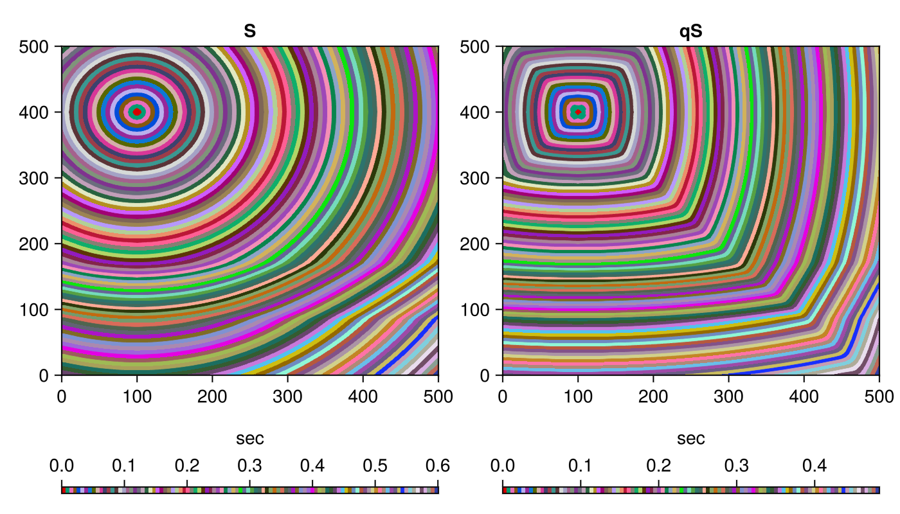
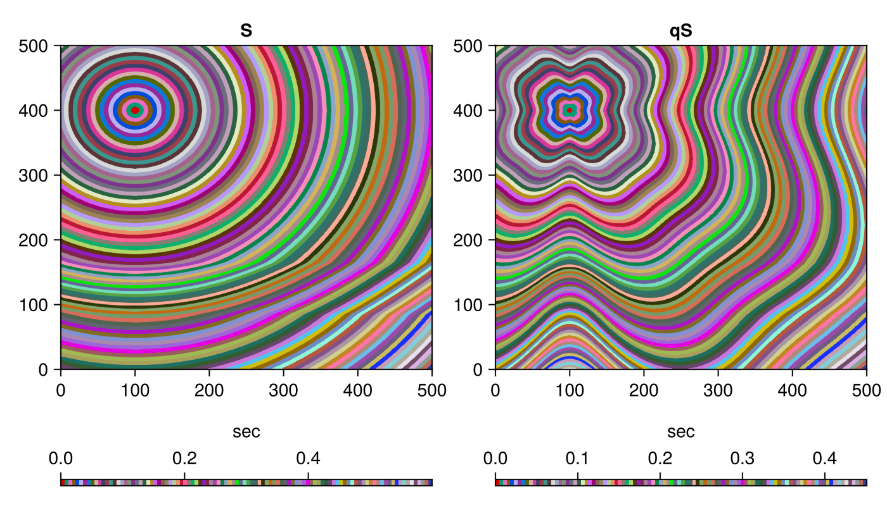

# SeisTimes

[](https://wtegtow.github.io/SeisTimes.jl/dev/)
[](https://github.com/wtegtow/SeisTimes.jl/actions/workflows/CI.yml?query=branch%3Amain)


SeisTimes is a toolkit for computing first-arrival seismic traveltimes in heterogeneous 2D and 3D anisotropic media.

Implemented are:
- Wavefront construction using the Lax-Friedrichs approximation of the static Hamilton-Jacobi (Eikonal) equation for weakly anisotropic media.
  - Fast Sweeping numerical scheme for general heterogeneous media on regular grids.
  - Includes 1st-, 3rd-, and 5th-order Lax-Friedrichs schemes for flexible accuracy.
- 2-Point ray tracing using the bending method for horizontally layered media.


# Installation
``` julia 
using Pkg
Pkg.add(url="https://github.com/wtegtow/SeisTimes.jl")
```

# Quick Start - Wavefront Construction (LxFS)

Wavefront exports 3 functionalities:
- Solid2D 
- Solid3D
- fast sweep

The solid object constructors take x,z or x,y,z coordinates and nx,nz or nx,ny,nz arrays of P-wave and S-wave velocities for 2D and 3D problems, respectivly. 

Optional keyword arguments can be used to define anisotropic media:

```julia

iso2D = Solid2D(x_coords, z_coords, vp, vs)
vti2D = Solid2D(x_coords, z_coords, vp, vs; eps=eps, gam=gam, del=del)

iso3D = Solid3D(x_coords, y_coords, z_coords, vp, vs)
ort3D = Solid3D(x_coords, y_coords, z_coords, vp, vs; 
                eps1=eps1, eps2=eps2, gam1=gam1, gam2=gam2,
                del1=del1, del2=del2, del3=del3)

```

With:

- **2D Thomsen parameters:**  
  `eps`, `gam`, `del`

- **3D Tsvankin parameters:**  
  `eps1`, `eps2`, `gam1`, `gam2`, `del1`, `del2`, `del3`

Once defined, the solid objects can be passed to the **fast_sweep** function to compute traveltimes.
The following example shows a basic 2D use case. The 3D version works analogously.

```julia

using SeisTimes
using GLMakie
Makie.inline!(true)

# 2d example
h = 5
x_coords = 0:h:500 
z_coords = 0:h:500 

vp  = zeros(length(x_coords), length(z_coords)) .+ 2000
vs  = zeros(length(x_coords), length(z_coords)) .+ 1000
eps = zeros(length(x_coords), length(z_coords)) .+ 0.25
del = zeros(length(x_coords), length(z_coords)) .- 0.1

# add some heterogeneity 
vp[:, 18:34] .= 2200.0  
vs[:, 18:34] .= 750.0 

# source location
source = [(100, 400)]

# create solid objects
iso = Solid2D(x_coords, z_coords, vp, vs)
vti = Solid2D(x_coords, z_coords, vp, vs; eps=eps, del=del)

# algorithm parameter 
wavemode = :S # :P, :S 
scheme = :LxFS5 # LxFS1 -> 1st order, LxFS3 -> 3rd order, LxFS5 -> 5th order Lax-Friedrich schemes 
verbose = false  
max_iter=200
max_error_tol = 1e-5   # convergence criterium
viscosity_buffer = 2.5 # stabilizer. If too small, solution diverge, if too large, computations take longer

# compute travel times
tt_iso = fast_sweep(iso, source, wavemode, scheme;
                    max_iter=max_iter, 
                    max_error_tol=max_error_tol,
                    viscosity_buffer=viscosity_buffer)

tt_vti = fast_sweep(vti, source, wavemode, scheme;
                    max_iter=max_iter, 
                    max_error_tol=max_error_tol,
                    viscosity_buffer=viscosity_buffer)

# visualize
name = ["S", "qS"]
imgs = [tt_iso, tt_vti]
fig = Figure(size=(700,400)) 
for (i, img) in enumerate(imgs)
    ax = Axis(fig[1,i], title=name[i])
    im = contourf!(ax, x_coords, z_coords, img, levels=100, colormap=:glasbey_bw_minc_20_n256)
    Colorbar(fig[2,i], im, vertical=false, height=5, label="sec")
end
save("docs/assets/img1.png", fig; px_per_unit=2)
display(fig)

```




# Quick Start - 2-Point Ray Tracing 

tracer exports 1 functionality:
- **ray_bending** 

which expects the following inputs:

- Matrix with layer properties:

  - For 2D: a [nlayer × 4] matrix with columns representing vp, vs, epsilon, and delta.

  - For 3D: a [nlayer × 9] matrix with columns representing vp, vs, epsilon1, epsilon2, gamma1, gamma2, delta1, delta2, and delta3.

- Depths of layer interfaces

Once defined, these objects can be passed to the **ray_bending** function to compute traveltimes.

**Note**: This ray tracing method is limited to horizontally layered media and accounts only for ray paths along layers intersected by the initial straight-line connection between source and receiver. High-velocity layers above or below are ignored, even if would provide a faster/true ray path.

For reference, the following 2D example computes the same travel time grids shown above.

```julia

using SeisTimes
using GLMakie
Makie.inline!(true)

# 2d example
h = 5
x_coords = 0:h:500 
z_coords = 0:h:500 
nx, nz = length(x_coords), length(z_coords)

# specify layer properties
vp_layers = [2000, 2200, 2000]
vs_layers = [1000, 750, 1000]
eps_layers = [0.25, 0.25, 0.25]
del_layers = [-0.1, -0.1, -0.1]

# assemble in [nlayer x 4] matrix
Miso = hcat(vp_layers, vs_layers, zeros(3), zeros(3))
Mvti = hcat(vp_layers, vs_layers, eps_layers, del_layers)

# specify interface depths (same as above)
interface_depths = [z_coords[18], z_coords[34]]

wavemode = :S # :P, :S 
source = (100, 400)

# compute travel times with 2-point ray tracing 
tt_iso = zeros(nx,nz)
tt_vti = zeros(nx,nz)

for x in 1:nx, z in 1:nz 
    rcv = (x_coords[x], z_coords[z]) # receiver
    if src != rcv
        tt_iso[x,z] = ray_bending(wavemode, Miso, interface_depths, source, rcv; verbose=false).t 
        tt_vti[x,z] = ray_bending(wavemode, Mvti, interface_depths, source, rcv; verbose=false).t
    end 
end 

# visualize
name = ["S", "qS"]
imgs = [tt_iso, tt_vti]
fig = Figure(size=(700,400)) 
for (i, img) in enumerate(imgs)
    ax = Axis(fig[1,i], title=name[i])
    im = contourf!(ax, x_coords, z_coords, img, levels=100, colormap=:glasbey_bw_minc_20_n256)
    Colorbar(fig[2,i], im, vertical=false, height=5, label="sec")
end
display(fig)

```



As can be seen, the Lax-Friedrichs wavefront construction method selects the slowest branch of the multivalued qS wavefront, rather than the faster cuspidal branches. In contrast, ray tracing captures the singularities of the qS-wave.


The 3D variants work analogously.
See the examples/ folder for more complex use cases.

# References

- Grechka, V., Anisotropy and Microseismics: Theory and Practice. Society of Exploration Geophysicists, 2020, Chapter 6.
- Jiang, G. S., and D. Peng, Weighted ENO schemes for Hamilton-Jacobi equations, 2000.
- Kao, C. Y., S. Osher, and J. Qian, Lax-Friedrichs sweeping schemes for
static Hamilton-Jacobi equations, 2004.